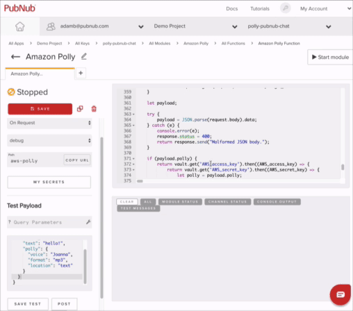

# Speech Enabled Chat App

This repo contains the source code for a sample application that demonstrates how to build accessible apps for chat clients, built with PubNub, jQuery, and Amazon Polly.

The source code for this chat app is in JavaScript. The UI frontend uses the standard JavaScript libraries like jQuery, so some level of familiarity with jQuery and standard JavaScript language is expected.

For reference, here is the complete documentation of [PubNub](https://www.pubnub.com/). The Amazon Polly documentation can be accessed in this [link](https://aws.amazon.com/polly/).

Clone this repository and follow the steps below the build and deploy this app. However, before you proceed, you must have an account in PubNub and AWS.

1. Create your [PubNub developer account](https://dashboard.pubnub.com/)

2. Create your free [AWS account](https://portal.aws.amazon.com/billing/signup#/start)

## [Get Free PubNub API Keys](#get-free-pubnub-api-keys)

### Step 1 : Make a [PubNub Account](https://admin.pubnub.com/)

### Step 2 : Enable the Presence, Functions, and Storage & Playback Features

Now your app infrastructure is created. For enabling speech feature, head over to the next section.

## [Set Up Amazon Polly Service](#set-up-amazon-polly-service)

Follow these steps to set up your AWS account for accessing Amazon Polly service

### Step 1 : Setup an IAM user to access Amazon Polly service

Follow [these steps](https://docs.aws.amazon.com/polly/latest/dg/setting-up.html) to create an IAM user for Amazon Polly. Make sure that the IAM user has full permissions for accessing Amazon Polly service. 

### Step 2 : Download the IAM user credentials

Download the credentials file for the IAM user and save it. This file contains the AWS ACCESS KEY and AWS ACCESS SECRET KEY. Make a note of these two parameters. 

## [Set Up Serverless PubNub Functions REST API](#asd)

The PubNub Function streams the binary audio payload for synthesized speech. Import an [AWS Polly PubNub Function](https://www.pubnub.com/docs/blocks-catalog/amazon-polly?devrel_gh=shyam) copy in your account.

Insert your AWS API keys in the PubNub Functions Vault.

Then click the play button in the PubNub Functions editor for your Polly Function.

### Step 3 - Activate / Deactivate Speech prompt for chat messages

Now, you can chat between the two users just like a regular chat app. 

For activating the speech prompt, click on the top right icon. It will turn green to indicate that speech is enabled, and all subsequent chat messages will also be accompanied with a speech that you can hear from the speaker. 

[Video Demo]
https://youtu.be/Ulm0E4vVRtc

## Caution

This app may not work on Microsoft Edge. 
