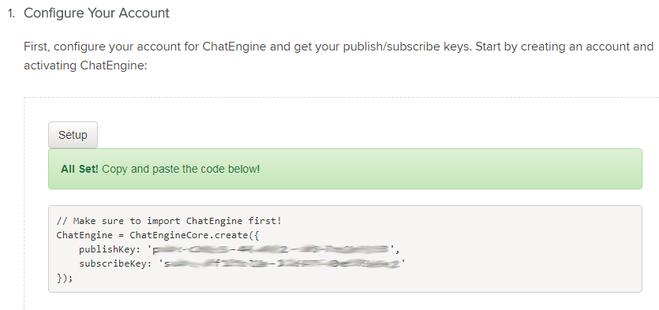

# Speech Enabled Chat App

This repo contains the source code for a sample application that demonstrates how to build accessible apps for chat clients, built with PubNub ChatEngine and Amazon Polly.

The source code for this chat app is in Javascript and python. The UI frontend uses the standard javascript libraries like JQuery, so some level of familiarity with JQuery and standard Javascript language is expected.

For reference, here is the complete documentation of [PubNub ChatEngine](https://www.pubnub.com/products/chatengine/). The Amazon Polly documentation can be accessed in this [link](https://aws.amazon.com/polly/).

Clone this repository and follow the steps below the build and deploy this app. However, before you proceed, you must have an account in PubNub and AWS.

1. Create your [PubNub developer account](https://admin.pubnub.com/)

2. Create your free [AWS account](https://portal.aws.amazon.com/billing/signup#/start)

## [Setup Basic ChatEngine App](#setup-basic-chatengine-app)

### Step 1 : Login to your [PubNub App Console](https://admin.pubnub.com/)

### Step 2 : Activate ChatEngine in your PubNub account

Follow these steps in [ChatEngine QuickStart Tutorial](https://www.pubnub.com/docs/tutorials/chatengine#step-one-pubnub-keys) to set up your chat app instance. Check the first step "Configure Your Account" in quickstart tutorial and click on the setup button.

### Step 3 : Wait for a few seconds. Once done, you will get a new PubNub app created within your account with a new set of publish and subscribe keys.

### Step 4 : Check that a new app is created in your PubNub admin dashboard.

Now your app infrastructure is created. For enabling speech feature, head over to the next section.

## [Set Up Amazon Polly Service](#set-up-amazon-polly-service)

Follow these steps to set up your AWS account for accessing Amazon Polly service

### Step 1 : Setup an IAM user to access Amazon Polly service

Follow [these steps](https://docs.aws.amazon.com/polly/latest/dg/setting-up.html) to create an IAM user for Amazon Polly. Make sure that the IAM user has full permissions for accessing Amazon Polly service. 

### Step 2 : Download the IAM user credentials

Download the credentials file for the IAM user and save it. This file contains the AWS ACCESS KEY and AWS ACCESS SECRET KEY. Make a note of these two parameters. 

## [Set Up Speech Streaming Server](#set-up-speech-streaming-server)

The server hosts the chat app as well as streams the binary audio payload for synthesized speech.

### Step 1 - Update AWS credentials in the server

Since the server calls the Amazon Polly service, we need to ensure that we follow AWS's norms of defining the credentials of the user on whose behalf the service will be called.

To do this, update the line 71 with AWS user's access key (AWS ACCESS KEY) and line 72 with AWS user's secret key (AWS ACCESS SECRET KEY), in [server.py](/server.py).

### Step 2 - Run the server

To run the server execute the [server.py](/server.py) script under python 3 environment.

    python server.py
    
Note : Make sure that the python command and the script file are in correct path.

## [Deploy App](#deploy-app)

We are all set now. Follow the steps below to set up the chat app and deploy it.

### Step 1 - Update PubNub credentials

Before launching the app, make sure to update the PubNub keys in the [chat.js](/chat.js) file.

Update Line 4 with the PubNub publish key and line 5 with PubNub subscribe key.

### Step 2 - Launch the app

Launch the app as two separate browser tabs. For best results, choose two different browsers ( ex, Chrome and Firefox) for this.

    http://localhost:8000/index.html

### Step 3 - Activate / Deactivate Speech prompt for chat messages

Now, you can chat between the two users just like a regular chat app. 

For activating the speech prompt, click on the top right icon. It will turn green to indicate that speech is enabled, and all subsequent chat messages will also be accompanied with a speech that you can hear from the speaker. 

[Video Demo](
https://github.com/shyampurk/SpeechEnabledChatApp/blob/master/screenshots/screencast.mp4)

## Caution

This app may not work on Microsoft Edge. 
